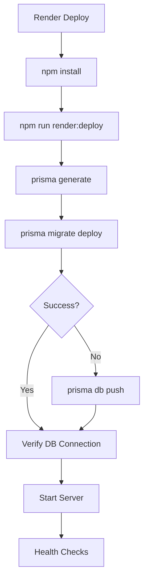

# CS2 Skin Tracker - Render Deployment Guide

## 🚀 Automatic Prisma Migrations on Render

This backend is configured to automatically run Prisma migrations on every deployment to Render.

### 📁 Files Added/Modified

- `scripts/render-deploy.js` - Runs migrations before deployment
- `scripts/render-start.js` - Starts server after migrations
- `package.json` - Added Render-specific scripts
- `render.yaml` - Render service configuration
- `Dockerfile` - Container configuration for Render

### 🔧 Render Configuration

#### Service Settings
- **Build Command**: `npm install && npm run render:deploy`
- **Start Command**: `npm run render:start`
- **Health Check**: `/api/health`
- **Port**: `10000`

#### Environment Variables Required
```bash
DATABASE_URL=postgresql://...
CLERK_SECRET_KEY=sk_...
CLERK_PUBLISHABLE_KEY=pk_...
JWT_SECRET=your-jwt-secret
NODE_ENV=production
PORT=10000
```

### 🗄️ Database Migration Process

1. **Build Phase**: 
   - Installs dependencies
   - Runs `render:deploy` script
   - Generates Prisma Client
   - Executes `prisma migrate deploy`
   - Falls back to `prisma db push` if migrations fail

2. **Start Phase**:
   - Verifies database connection
   - Starts Express server
   - Health checks every 30s

### 🛡️ Error Handling

- **Migration Failure**: Falls back to `db push`
- **Database Connection**: Verifies before starting server
- **Health Checks**: Automatic restart if unhealthy
- **Graceful Shutdown**: Handles SIGTERM/SIGINT

### 📊 Monitoring

- Health endpoint: `GET /api/health`
- Build info: `GET /api/health/build-info`
- Cron status: `GET /api/health/cron-status`

### 🔄 Deployment Flow



### 🚨 Troubleshooting

#### Migration Fails
- Check `DATABASE_URL` is correct
- Verify database permissions
- Check Prisma schema syntax

#### Server Won't Start
- Check all environment variables
- Verify database connectivity
- Check logs in Render dashboard

#### Health Check Fails
- Ensure `/api/health` endpoint responds
- Check server is listening on correct port
- Verify database queries work

### 📝 Manual Commands

```bash
# Local development
npm run dev

# Production start
npm run render:start

# Run migrations only
npm run render:deploy

# Database operations
npm run migrate
npm run db:push
```

### 🔗 Render Dashboard

After deployment, monitor your service at:
- **Service URL**: `https://your-service-name.onrender.com`
- **Health Check**: `https://your-service-name.onrender.com/api/health`
- **Database**: Check Render dashboard for database status
