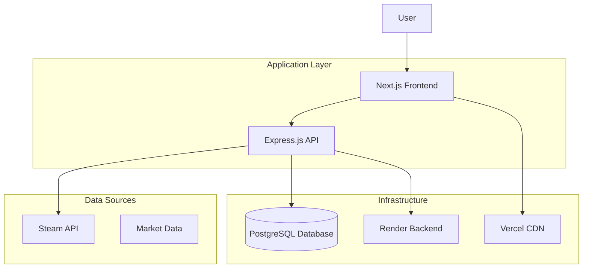
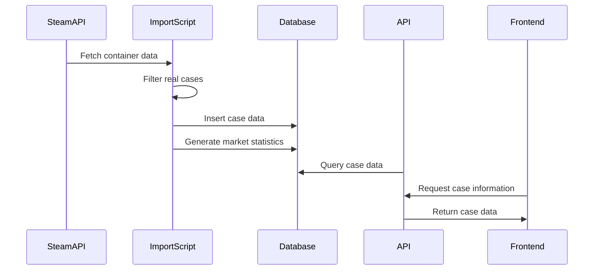
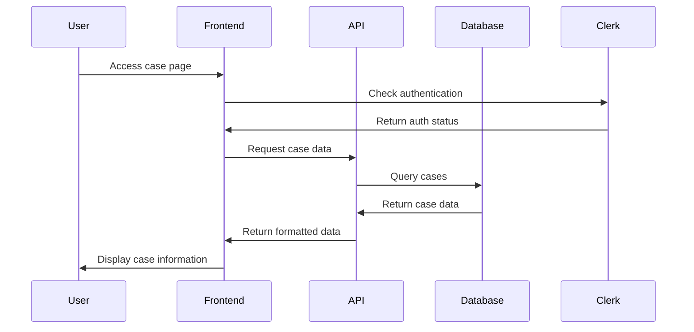

# System Architecture

## Overview

The CS2 Skin Tracker is a full-stack web application that provides comprehensive tracking and analysis of CS2 skin market data, including individual skins and cases. The system is built with modern technologies and follows best practices for scalability, maintainability, and user experience.

## High-Level Architecture



## Technology Stack

### Frontend
- **Framework**: Next.js 14 with App Router
- **Language**: TypeScript
- **Styling**: Tailwind CSS
- **UI Components**: Custom components with Radix UI primitives
- **Charts**: React Chart.js
- **Authentication**: Clerk
- **State Management**: React hooks and context
- **Deployment**: Vercel

### Backend
- **Runtime**: Node.js
- **Framework**: Express.js
- **Language**: JavaScript/TypeScript
- **Database**: PostgreSQL
- **ORM**: Prisma
- **Authentication**: Clerk
- **API**: RESTful endpoints
- **Deployment**: Render

### Database
- **Type**: PostgreSQL
- **ORM**: Prisma Client
- **Migrations**: Prisma migrations
- **Indexing**: Optimized for query performance
- **Relationships**: Proper foreign key constraints

## Data Flow

### 1. Data Import Process


### 2. User Interaction Flow


## Database Schema

### Core Models

#### Case Model
```prisma
model Case {
  id           Int      @id @default(autoincrement())
  name         String
  imageUrl     String?
  description  String?
  releaseDate  DateTime?
  isDiscontinued Boolean
  price        Float?
  marketCap    Float?
  remaining    Int?
  dropped      Int?
  unboxed      Int?
  timeToExtinction Float?
  priceChange24h Float?
  priceChange7d  Float?
  priceChange30d Float?
  lastUpdated  DateTime @updatedAt
  createdAt    DateTime @default(now())
  updatedAt    DateTime @updatedAt
  
  caseSkins      CaseSkin[]
  caseSupply     CaseSupply[]
  casePriceHistory CasePriceHistory[]
}
```

#### Skin Model
```prisma
model Skin {
  id           Int      @id @default(autoincrement())
  name         String
  marketHashName String @unique
  imageUrl     String?
  weaponType   String?
  collection   String?
  wear         String?
  rarity       String?
  quality      String?
  priceLatest  Float?
  priceAvg     Float?
  // ... additional price fields
  
  caseSkins    CaseSkin[]
  watchlist    Watchlist[]
  portfolio    Portfolio[]
}
```

#### CaseSkin Model
```prisma
model CaseSkin {
  id        Int @id @default(autoincrement())
  caseId    Int
  skinId    Int
  rarity    String
  dropChance Float?
  isSpecial Boolean @default(false)
  
  case      Case @relation(fields: [caseId], references: [id])
  skin      Skin @relation(fields: [skinId], references: [id])
}
```

## API Architecture

### RESTful Endpoints

#### Case Endpoints
- `GET /api/v1/cases` - List all cases
- `GET /api/v1/cases/{id}` - Get case details
- `GET /api/v1/cases/{id}/supply` - Get supply history
- `GET /api/v1/cases/{id}/price-history` - Get price history
- `GET /api/v1/cases/{id}/skins` - Get contained skins

#### Skin Endpoints
- `GET /api/v1/skins` - List all skins
- `GET /api/v1/skins/{id}` - Get skin details
- `GET /api/v1/skins/{id}/case-info` - Get case information for skin

### Response Format
```typescript
interface APIResponse<T> {
  data?: T;
  error?: string;
  message?: string;
  pagination?: {
    total: number;
    limit: number;
    offset: number;
  };
}
```

## Frontend Architecture

### Component Structure
```
src/
├── app/                    # Next.js App Router
│   ├── cases/             # Case pages
│   │   ├── page.tsx       # Cases list
│   │   └── [id]/          # Case detail pages
│   ├── skins/             # Skin pages
│   └── dashboard/         # Dashboard
├── components/            # Reusable components
│   ├── charts/           # Chart components
│   ├── ui/               # UI primitives
│   └── skins/            # Skin-specific components
├── lib/                  # Utility functions
│   ├── api.ts           # API client
│   └── num.ts           # Number formatting
└── hooks/               # Custom React hooks
```

### State Management
- **Local State**: React hooks (useState, useEffect)
- **Global State**: React Context API
- **Server State**: SWR for data fetching
- **Form State**: React Hook Form

## Security

### Authentication
- **Provider**: Clerk
- **Methods**: Email/password, OAuth
- **Session Management**: JWT tokens
- **Role-based Access**: User, Admin roles

### API Security
- **CORS**: Configured for all origins
- **Rate Limiting**: 100 requests/minute per IP
- **Input Validation**: Prisma validation
- **SQL Injection**: Prevented by Prisma ORM

### Data Protection
- **Environment Variables**: Sensitive data in env files
- **Database**: Encrypted connections
- **API Keys**: Secure storage and rotation

## Performance

### Frontend Optimization
- **Code Splitting**: Next.js automatic splitting
- **Image Optimization**: Next.js Image component
- **Caching**: Vercel CDN caching
- **Bundle Size**: Tree shaking and minification

### Backend Optimization
- **Database Indexing**: Optimized queries
- **Connection Pooling**: Prisma connection pool
- **Caching**: Response caching where appropriate
- **Compression**: Gzip compression

### Database Optimization
- **Indexes**: Strategic indexing on frequently queried fields
- **Query Optimization**: Efficient Prisma queries
- **Connection Pooling**: Managed connection pool
- **Monitoring**: Query performance monitoring

## Deployment

### Frontend (Vercel)
- **Build Command**: `npm run build`
- **Output Directory**: `.next`
- **Environment Variables**: Configured in Vercel dashboard
- **CDN**: Global edge network
- **SSL**: Automatic HTTPS

### Backend (Render)
- **Build Command**: `npm install && npm run build`
- **Start Command**: `npm start`
- **Environment Variables**: Configured in Render dashboard
- **Database**: Managed PostgreSQL
- **SSL**: Automatic HTTPS

### Database (PostgreSQL)
- **Provider**: Render managed PostgreSQL
- **Version**: PostgreSQL 16
- **Backups**: Automated daily backups
- **Monitoring**: Performance monitoring
- **Scaling**: Vertical scaling available

## Monitoring and Logging

### Application Monitoring
- **Error Tracking**: Console error logging
- **Performance**: Response time monitoring
- **Uptime**: Service availability monitoring
- **Metrics**: Custom business metrics

### Database Monitoring
- **Query Performance**: Slow query detection
- **Connection Pool**: Pool utilization monitoring
- **Storage**: Disk usage monitoring
- **Backups**: Backup success monitoring

## Development Workflow

### Code Quality
- **Linting**: ESLint configuration
- **Formatting**: Prettier configuration
- **Type Checking**: TypeScript strict mode
- **Git Hooks**: Pre-commit validation

### Testing Strategy
- **Unit Tests**: Component and utility testing
- **Integration Tests**: API endpoint testing
- **E2E Tests**: User workflow testing
- **Performance Tests**: Load and stress testing

### Deployment Pipeline
1. **Development**: Local development with hot reload
2. **Staging**: Preview deployments on Vercel
3. **Production**: Automatic deployment on main branch
4. **Monitoring**: Post-deployment monitoring

## Scalability Considerations

### Horizontal Scaling
- **Frontend**: Vercel CDN handles scaling
- **Backend**: Render auto-scaling
- **Database**: Read replicas for read-heavy workloads

### Vertical Scaling
- **Backend**: Increased memory and CPU
- **Database**: Larger instance sizes
- **Storage**: Increased disk space

### Performance Bottlenecks
- **Database Queries**: Optimize slow queries
- **API Responses**: Implement caching
- **Frontend Rendering**: Code splitting and lazy loading
- **Image Loading**: Optimize image sizes and formats

## Future Enhancements

### Planned Features
- **Real-time Updates**: WebSocket integration
- **Mobile App**: React Native application
- **Advanced Analytics**: Machine learning insights
- **API Rate Limiting**: Per-user rate limiting
- **Caching Layer**: Redis implementation

### Technical Improvements
- **Microservices**: Service decomposition
- **Event Sourcing**: Event-driven architecture
- **GraphQL**: Alternative to REST API
- **Containerization**: Docker deployment
- **CI/CD**: Automated testing and deployment

## Conclusion

The CS2 Skin Tracker architecture is designed for scalability, maintainability, and performance. The system uses modern technologies and follows best practices to provide a robust platform for skin market analysis and tracking.

The modular architecture allows for easy feature additions and improvements while maintaining system stability and performance. The comprehensive monitoring and logging ensure that issues can be quickly identified and resolved.