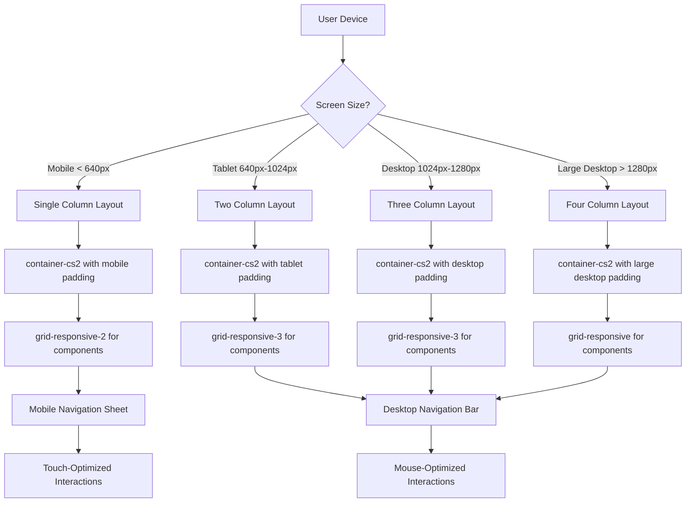
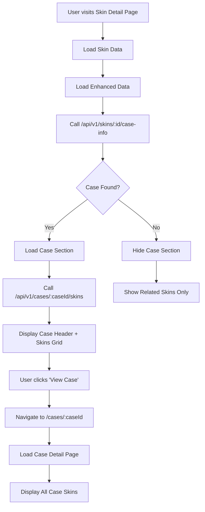
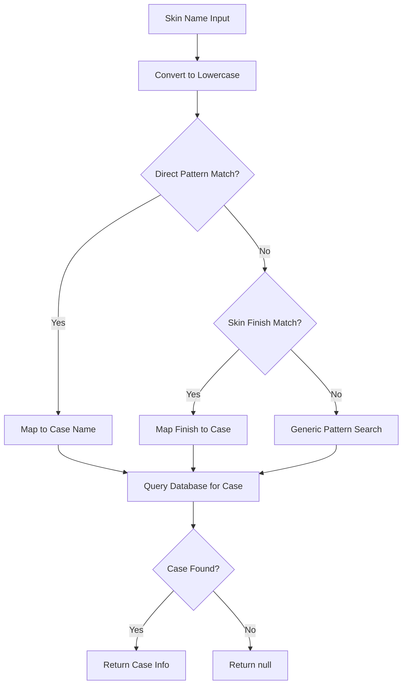

Architecture Overview
=====================

System Components
-----------------

### Frontend (Next.js App Router)
* **Hosting:** Vercel
* **Framework:** Next.js 15.4.3 with App Router
* **Styling:** Tailwind CSS + Shadcn UI + Custom Responsive System
* **Authentication:** Clerk
* **State Management:** React hooks (useState, useEffect, useMemo)
* **Layout System:** Mobile-first responsive design with custom CSS utilities

### Backend (Node.js/Express)
* **Hosting:** Render
* **Framework:** Express.js
* **Database:** PostgreSQL via Prisma ORM
* **Authentication:** Clerk JWT verification
* **API:** RESTful endpoints with `/api/v1` prefix

### Database
* **Provider:** Supabase (PostgreSQL)
* **ORM:** Prisma
* **Schema:** Located in `backend/prisma/schema.prisma`

Data Flow
---------

### Responsive Layout System Flow



### Case System Flow



### Case Mapping Logic



API Endpoints
-------------

### Case Endpoints
* `GET /api/v1/cases/:caseId` - Get case metadata
* `GET /api/v1/cases/:caseId/skins` - List skins in case
* `GET /api/v1/skins/:skinId/case-info` - Resolve skin's case

### Case Mapping Strategies
1. **Direct Patterns:** "recoil" → "Recoil Case"
2. **Skin Finishes:** "case hardened" → "Operation Bravo Case"
3. **Generic Patterns:** Fallback for edge cases

Components
----------

### Frontend Components

#### Layout System (`/frontend/src/app/globals.css`)
* **Purpose:** Responsive layout utilities and container system
* **Features:**
  - `container-cs2`: Main content container with max-width constraints
  - `section-cs2`: Section spacing with responsive vertical padding
  - `grid-responsive`: Responsive grid utilities (1-4 columns)
  - Mobile-first breakpoints and responsive design patterns
  - Custom CSS utilities for consistent spacing and layout

#### Dashboard Layout (`/frontend/src/app/dashboard/page.tsx`)
* **Purpose:** Main dashboard with responsive grid system
* **Features:**
  - Responsive header with flexible layout for mobile/desktop
  - Three-tier grid system (Portfolio + Alerts, Breakdown + Market + Events, Movers)
  - Mobile-optimized P&L and KPI sections
  - Responsive text sizing and component spacing
  - Animation system with staggered loading

#### AppHeader (`/frontend/src/app/components/AppHeader.tsx`)
* **Purpose:** Responsive navigation header with search integration
* **Features:**
  - Desktop/mobile navigation patterns
  - Responsive search bar with proper width constraints
  - Mobile sheet navigation for small screens
  - Profile dropdown integration
  - Sticky positioning with backdrop blur

#### SkinSearchBar (`/frontend/src/app/components/SkinSearchBar.tsx`)
* **Purpose:** Responsive search component with dropdown results
* **Features:**
  - Full-width responsive design
  - Debounced search with loading states
  - Dropdown results with skin images
  - Mobile-optimized touch interactions
  - Flexible container constraints

#### CaseSection (`/frontend/src/components/CaseSection.tsx`)
* **Purpose:** Display case info and skins grid on skin detail page
* **Props:** `{ skinId: number }`
* **Features:**
  - Case header with thumbnail and metadata
  - Grid of skins from the same case
  - "View Case" and "Open on Steam" buttons
  - Loading and empty states
  - Only renders when case is found

#### Case Detail Page (`/frontend/src/app/cases/[id]/page.tsx`)
* **Purpose:** Complete case information display
* **Features:**
  - Case header with image and metadata
  - Grid of all skins in the case
  - Navigation back button
  - External Steam market integration

### Backend Controllers

#### CaseController (`/backend/src/controllers/caseController.js`)
* **getCaseById:** Fetch case metadata by ID
* **getCaseSkins:** List all skins in a case
* **getSkinCase:** Resolve case for a specific skin

Database Schema
---------------

### Skin Model
```prisma
model Skin {
  id          Int      @id @default(autoincrement())
  name        String
  weaponType  String
  itemGroup   String?
  // ... other fields
}
```

### Case Resolution
* Cases are identified by `weaponType: "case"`
* Case-skin relationships are inferred through pattern matching
* No direct foreign key relationship (future enhancement)

Security
--------

### Authentication
* All case endpoints use `optionalClerkAuth` middleware
* JWT tokens verified via Clerk JWKS
* No sensitive data exposed in case responses

### Data Validation
* Case IDs validated before database queries
* Pattern matching prevents injection attacks
* Graceful handling of missing cases (404 responses)

Performance
-----------

### Caching Strategy
* No explicit caching implemented
* Database queries optimized with proper indexing
* Frontend uses React state for component-level caching

### Optimization
* Case mapping logic runs server-side
* Skin grids limited to reasonable sizes (12-24 items)
* Lazy loading for case detail pages

Deployment
----------

### Frontend (Vercel)
* Automatic deployment on git push
* Environment variables for API endpoints
* Build optimization with Next.js

### Backend (Render)
* Automatic deployment on git push
* Environment variables for database and Clerk
* Health checks and monitoring

### Database (Supabase)
* PostgreSQL with Prisma ORM
* Connection pooling
* Automated backups

Monitoring
----------

### Error Handling
* Try-catch blocks in all case operations
* Graceful degradation when cases not found
* Console logging for debugging

### Analytics
* User interaction tracking via `useAnalytics`
* Case section visibility tracking
* Performance metrics collection

Future Enhancements
-------------------

### Database Improvements
* Add direct `caseId` foreign key to Skin model
* Create dedicated Case model
* Implement proper case-skin relationships

### Performance
* Redis caching for case data
* CDN for case images
* Database query optimization

### Features
* Case opening simulation
* Case value calculations
* Historical case data
* Case recommendation system
