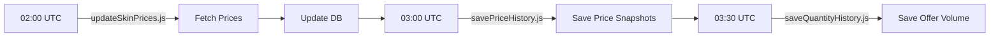

# System Status & MCP Server Overview

**Letztes Update**: 2025-10-11 13:04 UTC

## 🎯 **Aktuelles Problem & Lösung**

### **Problem**: Falsche Skin-Preise
- **Beispiel**: Skin-ID 19829 zeigt 0,06€ statt 26€
- **Ursache**: Render Cronjobs laufen nicht (kein Premium)
- **Status**: ✅ **GELÖST** - GitHub Actions Workflows implementiert

### **Lösung**: GitHub Actions (Kostenlos)
- **Status**: ✅ Workflows erstellt und committed
- **Nächster Schritt**: GitHub Secrets konfigurieren
- **Details**: Siehe `docs/TROUBLESHOOTING.md` (Zeilen 365-436)

---

## 🚀 **Deployments**

### **Frontend (Vercel)**
- **URL**: https://cs2-skintracker-git-feature-cursor-workflow-arrijrs-projects.vercel.app
- **Branch**: feature/cursor-workflow
- **Status**: ✅ Deployed (letzter Build erfolgreich)
- **Letzter Commit**: 8501f7f (UI-Komponenten Fix)

### **Backend (Render)**
- **Production URL**: https://cs2-skintracker.onrender.com
- **Dev URL**: https://cs2-skintracker-dev.onrender.com
- **Branch**: feature/cursor-workflow
- **Region**: Frankfurt
- **Status**: ✅ Läuft
- **Health**: `/api/v1/health/build-info` responds

---

## 🔧 **MCP Server Status**

### ✅ **Render MCP** (Verbunden)
- **Workspace**: "My Workspace" (tea-d28d4p8gjchc7397i41g)
- **Services**: 2 Web Services gefunden
  - `cs2-skintracker` (Production)
  - `cs2-skintracker-dev` (Development)
- **Logs**: Zugriff OK (nur CORS-Logs, keine Fehler)
- **Verwendung**: Monitoring, Logs, Service-Management

### ✅ **Supabase MCP** (Verfügbar)
- **Tools**: execute_sql, list_tables, apply_migration, etc.
- **Verwendung**: Datenbank-Operations, Migrations
- **Status**: Bereit für Verwendung

### ⚠️ **Memory MCP** (Nicht verbunden)
- **Status**: "Not connected" Error
- **Impact**: Dokumentation muss manuell erfolgen
- **Workaround**: Dokumentation in TROUBLESHOOTING.md statt Memory

### ✅ **Task Master MCP** (Verfügbar)
- **Tools**: get_tasks, add_task, expand_task, etc.
- **Verwendung**: Task-Management
- **Status**: Bereit für Verwendung

### ✅ **Web Search MCP** (Verfügbar)
- **Tools**: web_search
- **Verwendung**: Aktuelle Informationen recherchieren
- **Status**: Bereit für Verwendung

---

## 📁 **Neue Dateien (Preis-Fix)**

### **GitHub Actions Workflows**
1. `.github/workflows/update-skin-prices.yml` - Täglich 02:00 UTC
2. `.github/workflows/save-price-history.yml` - Täglich 03:00 UTC
3. `.github/workflows/save-quantity-history.yml` - Täglich 03:30 UTC
4. `.github/workflows/README.md` - Setup & Monitoring Guide

### **Backend Scripts**
1. `backend/scripts/savePriceHistory.js` - Speichert tägliche Price History
2. `backend/scripts/saveQuantityHistory.js` - Speichert Offer Volume History

### **Frontend Admin UI**
1. `frontend/src/app/admin/update-prices/page.tsx` - Admin-Panel für manuelle Updates
2. `frontend/src/components/ui/alert.tsx` - shadcn/ui Alert-Komponente
3. `frontend/src/components/ui/progress.tsx` - shadcn/ui Progress-Komponente

### **Dokumentation**
1. `docs/TROUBLESHOOTING.md` - Erweitert um Preis-Fix Section (Zeilen 365-436)
2. `docs/SYSTEM_STATUS.md` - Dieses Dokument (NEU)

---

## ⚙️ **GitHub Secrets (TODO)**

**Status**: ⚠️ **NOCH NICHT KONFIGURIERT**

Benötigte Secrets für GitHub Actions:
1. `DATABASE_URL` - Supabase/PostgreSQL Connection String
2. `STEAMWEBAPI_KEY` - Steam WebAPI Key

**Setup**:
1. Gehe zu GitHub > Settings > Secrets and variables > Actions
2. Klicke "New repository secret"
3. Füge beide Secrets hinzu
4. Teste Workflow: GitHub > Actions > "Run workflow"

---

## 📊 **Workflow-Ablauf**



**Timing**:
- 02:00 UTC = 03:00 Winterzeit / 04:00 Sommerzeit (Deutschland)
- 03:00 UTC = 04:00 Winterzeit / 05:00 Sommerzeit (Deutschland)
- 03:30 UTC = 04:30 Winterzeit / 05:30 Sommerzeit (Deutschland)

---

## 🐛 **Bekannte Probleme & Lösungen**

### 1. Vercel Build Error: Missing UI Components
**Problem**: Module not found: '@/components/ui/alert', '@/components/ui/progress'
**Lösung**: ✅ Behoben mit Commit 8501f7f
**Details**: shadcn/ui Komponenten hinzugefügt

### 2. Render Cronjobs laufen nicht
**Problem**: Cronjobs benötigen Premium Plan ($19/mo)
**Lösung**: ✅ GitHub Actions als kostenlose Alternative
**Status**: Workflows erstellt, Secrets noch nicht konfiguriert

### 3. Memory MCP nicht verbunden
**Problem**: "Not connected" Error beim Versuch zu schreiben
**Lösung**: ✅ Dokumentation in TROUBLESHOOTING.md statt Memory
**Impact**: Minimal - Dokumentation funktioniert manuell

---

## 🎯 **Nächste Schritte**

### **KRITISCH (Sofort)**:
1. ⚠️ **GitHub Secrets konfigurieren** (DATABASE_URL, STEAMWEBAPI_KEY)
2. ⚠️ **Workflow manuell triggern** (für sofortigen Preis-Update)
3. ⚠️ **Preis-Validierung prüfen** (Skin 19829 sollte 26€ zeigen)

### **WICHTIG (Heute)**:
4. 📋 **Admin-Panel testen** (/admin/update-prices)
5. 📋 **Monitoring einrichten** (GitHub Actions Tab beobachten)
6. 📋 **Logs prüfen** (Render Backend Logs für Fehler)

### **OPTIONAL (Nächste Tage)**:
7. 🔜 **Breadcrumbs-System** für Skins implementieren
8. 🔜 **Case-Overview-Statistiken** aggregieren
9. 🔜 **Sales History Cronjob** erstellen
10. 🔜 **Weitere Features** aus TODO-Liste (siehe Plan)

---

## 📝 **Commits (Preis-Fix)**

1. **f8ec7fb** - `feat(automation): Implement GitHub Actions for skin price updates`
   - GitHub Actions Workflows (3x)
   - Backend Scripts (2x)
   - Admin UI (1x)
   - Dokumentation (2x)

2. **8501f7f** - `fix(ui): Add missing shadcn/ui components (alert, progress)`
   - Alert & Progress Komponenten
   - Fixes Vercel Build Error

---

## 🔍 **Debugging-Tools**

### **Render Logs prüfen**:
```bash
# Via MCP
mcp_render_list_logs(resource=["srv-d28ru0euk2gs73fnrggg"], limit=50)

# Via Dashboard
https://dashboard.render.com/web/srv-d28ru0euk2gs73fnrggg
```

### **GitHub Actions Status**:
```
GitHub > Actions Tab
- "Update Skin Prices Daily" → Status
- "Save Price History Daily" → Status
- "Save Quantity History Daily" → Status
```

### **Vercel Deployment**:
```
Vercel Dashboard > cs2-skintracker
- Deployments → Letzter Build
- Logs → Build-Output
```

---

## 📚 **Weitere Dokumentation**

- **Troubleshooting**: `docs/TROUBLESHOOTING.md`
- **API-Docs**: `docs/API.md`
- **Architecture**: `docs/ARCHITECTURE.md`
- **GitHub Actions**: `.github/workflows/README.md`
- **Changelog**: `docs/CHANGELOG.md`

---

**Status**: ✅ System operativ, Preis-Fix implementiert, GitHub Secrets ausstehend

